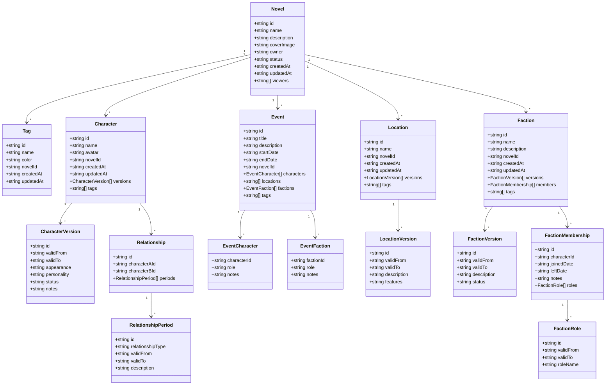
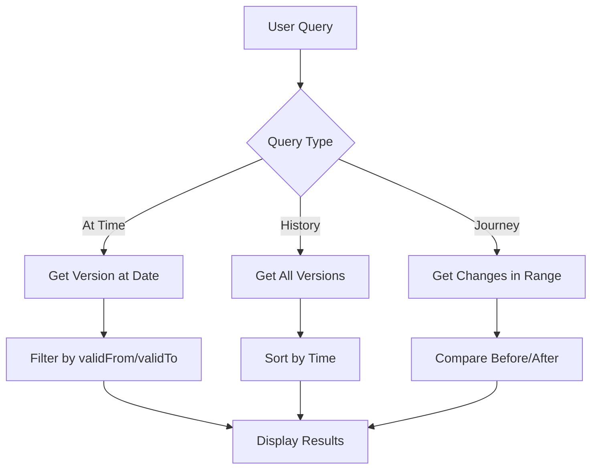

# Kế Hoạch Tái Cấu Trúc Nghiệp Vụ / Business Redesign Plan

## Tổng quan / Overview

**Mục tiêu / Objective:**
Tái cấu trúc nghiệp vụ của ứng dụng Story Manager để đáp ứng đầy đủ các yêu cầu trong SRS.md, trong khi giữ nguyên giao diện UI, TypeScript, icon, và màu sắc hiện có.

Restructure the business logic of Story Manager application to fully meet SRS.md requirements while preserving existing UI, TypeScript, icons, and color scheme.

---

## Phân Tích Sự Khác Biệt / Gap Analysis

### 1. Novel Entity (THÊM MỚI / NEW)

**Thiết kế cũ / Old Design:**

- Không có entity Novel
- Không có khái niệm ownership, public/private status
- Không có viewer management

**Thiết kế mới / New Design:**

```typescript
interface Novel {
  id: string;
  name: string;
  description: string;
  coverImage: string | null;
  owner: string; // User ID
  status: 'public' | 'private';
  createdAt: string;
  updatedAt: string;
  viewers: string[]; // Array of user IDs
}
```

**Quy tắc chia sẻ / Sharing Rules:**

- Private: Chỉ Owner và Viewers được chỉ định mới xem được
- Public: Tất cả mọi người (kể cả khách chưa đăng nhập) đều xem được
- Chia sẻ áp dụng cho toàn bộ tiểu thuyết, không chia sẻ từng phần

---

### 2. Character Entity

**Thiết kế cũ / Old Design:**

```typescript
interface CharacterAttribute {
  timeRange: TimeRange;
  role: string;
  age: number | null;
  gender: string;
  appearance: string;
  personality: string;
  background: string;
  goals: string;
  flaws: string;
  skills: string;
  notes: string;
}
```

**Thiết kế mới / New Design:**

```typescript
interface Character {
  id: string;
  name: string;
  avatar: string | null; // Upload ảnh đại diện
  novelId: string; // Thuộc novel nào
  createdAt: string;
  updatedAt: string;
  versions: CharacterVersion[];
  tags: string[]; // Array of tag IDs
}

interface CharacterVersion {
  id: string;
  validFrom: string | null; // Từ đầu truyện nếu null
  validTo: string | null; // Đến hiện tại nếu null
  appearance: string; // Ngoại hình (text - mô tả tự do)
  personality: string; // Tính cách (text - mô tả tự do)
  status: string; // "Sống", "Chết", "Mất tích"...
  notes: string;
}
```

**Sự khác biệt chính / Key Differences:**

1. ✅ Thêm `avatar` (upload ảnh đại diện)
2. ✅ Thêm `novelId` (thuộc novel nào)
3. ✅ Đổi tên `timeRange` → `validFrom`/`validTo` (nullable)
4. ✅ Bỏ `role`, `age`, `gender`, `background`, `goals`, `flaws`, `skills`
5. ✅ Giữ `appearance`, `personality`, `notes`
6. ✅ Thêm `status` (text: "Sống", "Chết", "Mất tích"...)
7. ✅ Thêm `tags` (array of tag IDs)

---

### 3. Relationship Entity

**Thiết kế cũ / Old Design:**

```typescript
interface RelationshipDetail {
  timeRange: TimeRange;
  relationshipType: string;
  description: string;
  status: 'active' | 'inactive' | 'complicated' | 'hostile' | 'allied';
  strength: number;
}
```

**Thiết kế mới / New Design:**

```typescript
interface Relationship {
  id: string;
  characterAId: string; // Nhân vật A
  characterBId: string; // Nhân vật B
  periods: RelationshipPeriod[];
}

interface RelationshipPeriod {
  id: string;
  relationshipType: string; // "Bạn bè", "Kẻ thù", "Vợ chồng", "Sư đồ"... (text - tự do nhập)
  validFrom: string | null;
  validTo: string | null;
  description: string; // Mô tả/ghi chú
}
```

**Sự khác biệt chính / Key Differences:**

1. ✅ Đổi tên `entity1Id`/`entity2Id` → `characterAId`/`characterBId` (chỉ áp dụng cho nhân vật)
2. ✅ Đổi tên `details` → `periods`
3. ✅ Đổi tên `timeRange` → `validFrom`/`validTo`
4. ✅ Bỏ `status` (active/inactive/complicated/hostile/allied)
5. ✅ Bỏ `strength` (mức độ mối quan hệ)
6. ✅ `relationshipType` là text tự do nhập (không phải enum)
7. ✅ Có thể có nhiều periods đồng thời giữa 2 nhân vật

---

### 4. Event Entity

**Thiết kế cũ / Old Design:**

```typescript
interface Event {
  id: string;
  name: string;
  description: string;
  timestamp: string;
  locationId: string | null;
  eventType: string;
  importance: 'low' | 'medium' | 'high' | 'critical';
  participants: string[]; // Character IDs
  outcome: string;
  impact: string;
}
```

**Thiết kế mới / New Design:**

```typescript
interface Event {
  id: string;
  title: string; // Tiêu đề
  description: string;
  startDate: string | null; // Ngày bắt đầu
  endDate: string | null; // Ngày kết thúc
  novelId: string; // Thuộc novel nào
  characters: EventCharacter[]; // Nhiều nhân vật tham gia
  locations: string[]; // 1 sự kiện có thể diễn ra ở nhiều địa điểm (many-to-many)
  factions: EventFaction[]; // Nhiều thế lực tham gia
  tags: string[]; // Gắn tags cho sự kiện
}

interface EventCharacter {
  characterId: string;
  role: string; // "Chỉ huy", "Tham gia", "Nạn nhân"...
  notes: string; // Mô tả về người đó tại sự kiện
}

interface EventFaction {
  factionId: string;
  role: string; // Vai trò
  notes: string; // Ghi chú
}
```

**Sự khác biệt chính / Key Differences:**

1. ✅ Đổi tên `name` → `title`
2. ✅ Đổi tên `timestamp` → `startDate`/`endDate` (nullable)
3. ✅ Thêm `novelId` (thuộc novel nào)
4. ✅ Đổi `participants: string[]` → `characters: EventCharacter[]` (có role + notes)
5. ✅ Đổi `locationId: string | null` → `locations: string[]` (many-to-many)
6. ✅ Thêm `factions: EventFaction[]` (nhiều thế lực tham gia)
7. ✅ Thêm `tags: string[]` (gắn tags cho sự kiện)
8. ✅ Bỏ `eventType`, `importance`, `outcome`, `impact`
9. ✅ Không cần phân cấp sự kiện (sự kiện lớn/sự kiện con)

---

### 5. Location Entity

**Thiết kế cũ / Old Design:**

```typescript
interface LocationAttribute {
  timeRange: TimeRange;
  locationType: string;
  climate: string;
  geography: string;
  population: string;
  culture: string;
  economy: string;
  government: string;
  notes: string;
}
```

**Thiết kế mới / New Design:**

```typescript
interface Location {
  id: string;
  name: string;
  novelId: string; // Thuộc novel nào
  createdAt: string;
  updatedAt: string;
  versions: LocationVersion[];
  tags: string[]; // Gắn tags
}

interface LocationVersion {
  id: string;
  validFrom: string | null;
  validTo: string | null;
  description: string; // Mô tả
  features: string; // Đặc điểm
}
```

**Sự khác biệt chính / Key Differences:**

1. ✅ Thêm `novelId` (thuộc novel nào)
2. ✅ Đổi tên `timeRange` → `validFrom`/`validTo`
3. ✅ Bỏ `locationType`, `climate`, `geography`, `population`, `culture`, `economy`, `government`
4. ✅ Giữ `description`, `notes` → `description`, `features`
5. ✅ Thêm `tags: string[]` (gắn tags)
6. ✅ Không cần phân cấp (Quốc gia > Thành phố...)

---

### 6. Faction Entity

**Thiết kế cũ / Old Design:**

```typescript
interface FactionAttribute {
  timeRange: TimeRange;
  factionType: string;
  ideology: string;
  goals: string;
  resources: string;
  influence: string;
  members: string[]; // Character IDs
  leader: string | null; // Character ID
  notes: string;
}
```

**Thiết kế mới / New Design:**

```typescript
interface Faction {
  id: string;
  name: string;
  description: string;
  novelId: string; // Thuộc novel nào
  createdAt: string;
  updatedAt: string;
  versions: FactionVersion[];
  members: FactionMembership[]; // Thành viên
  tags: string[]; // Gắn tags riêng cho thế lực
}

interface FactionVersion {
  id: string;
  validFrom: string | null;
  validTo: string | null;
  description: string; // Mô tả
  status: string; // "Hoạt động", "Giải tán"...
}

interface FactionMembership {
  id: string;
  characterId: string;
  joinedDate: string | null; // Ngày tham gia
  leftDate: string | null; // Ngày rời đi (null = đang tham gia)
  notes: string;
  roles: FactionRole[]; // Vai trò thay đổi theo thời gian
}

interface FactionRole {
  id: string;
  validFrom: string | null;
  validTo: string | null;
  roleName: string; // Vai trò được quản lý qua Tags
}
```

**Sự khác biệt chính / Key Differences:**

1. ✅ Thêm `novelId` (thuộc novel nào)
2. ✅ Đổi tên `timeRange` → `validFrom`/`validTo`
3. ✅ Bỏ `factionType`, `ideology`, `goals`, `resources`, `influence`, `leader`
4. ✅ Đổi `members: string[]` → `members: FactionMembership[]` (có joinedDate, leftDate, notes, roles)
5. ✅ Thêm `status` trong version ("Hoạt động", "Giải tán"...)
6. ✅ Thêm `tags: string[]` (gắn tags riêng cho thế lực)
7. ✅ Vai trò được quản lý qua Tags với versioning
8. ✅ Không cần phân cấp (tổ chức lớn > chi nhánh...)

---

### 7. Tag Entity (THÊM MỚI / NEW)

**Thiết kế cũ / Old Design:**

- Không có entity Tag

**Thiết kế mới / New Design:**

```typescript
interface Tag {
  id: string;
  name: string; // Tên tag
  color: string; // Hex color (#FF5733) - để phân biệt trực quan
  novelId: string; // Thuộc novel nào
  createdAt: string;
  updatedAt: string;
}
```

**Đặc điểm / Features:**

- Tags dùng chung cho toàn bộ novel
- 1 tag có thể gắn cho nhiều loại entities:
  - Nhân vật
  - Sự kiện
  - Địa điểm
  - Thế lực
  - Vai trò trong thế lực

---

## Quy tắc Versioning & Thời gian / Versioning & Time Rules

### Định dạng thời gian / Time Format

- Hỗ trợ: Ngày/Tháng/Năm (DD/MM/YYYY)
- Có thể chỉ có Năm (YYYY)
- Nullable: không xác định thời gian cụ thể

### Quy tắc versioning (áp dụng cho Character, Location, Faction)

```typescript
// Khoảng thời gian hiệu lực:
validFrom = NULL → Từ đầu truyện
validTo = NULL → Đến hiện tại/tương lai

// Ví dụ:
// Version 1: validFrom = NULL, validTo = 2014-12-31 → "Từ đầu đến 2014"
// Version 2: validFrom = 2015-01-01, validTo = NULL → "Từ 2015 đến nay"
```

**Truy vấn tại thời điểm / Query at time:**

```
Tìm version có: (validFrom IS NULL OR validFrom <= date) AND (validTo IS NULL OR validTo >= date)
Sắp xếp theo validFrom DESC → Lấy version 1 (gần nhất)
```

### Quy tắc cho Relationship Periods

- Tương tự versioning
- Có thể có nhiều periods cùng lúc (nhiều quan hệ đồng thời)

### Quy tắc cho Faction Membership

- Có thể có nhiều records (tham gia nhiều lần)
- Mỗi membership có joinedDate và leftDate
- Vai trò trong mỗi membership cũng có versioning

---

## Kiến trúc Dữ liệu Đề xuất / Proposed Data Architecture

### Entity Hierarchy



### Data Flow for Time-Based Queries



---

## Kế hoạch Triển khai / Implementation Plan

### Giai đoạn 1: Cấu Trúc Dữ Liệu Mới / Phase 1: New Data Structure

**Mục tiêu / Objective:**
Định nghĩa lại các types theo SRS.md, giữ nguyên giao diện UI hiện có.

Redefine types according to SRS.md while preserving existing UI.

#### 1.1 Tạo Novel Types / Create Novel Types

- [x] Tạo `src/types/novel.ts`
  - `Novel`: ID, tên, mô tả, coverImage, ownerId, status (public/private), createdAt, updatedAt
  - `NovelStatus`: 'public' | 'private'
  - `NovelSharing`: novelId, userId, role ('owner' | 'viewer')

- [x] Cập nhật `src/types/entities.ts`
  - Thêm Novel vào Entity union type
  - Thêm EntityType.NOVEL

#### 1.2 Cập nhật Character Types theo SRS / Update Character Types per SRS

- [x] Cập nhật `src/types/character.ts`
  - Thêm `novelId: string` vào Character
  - Thêm `avatar: string | null` vào Character
  - Thêm `tags: string[]` vào Character
  - Cập nhật `CharacterAttribute`:
    - `appearance: string` (ngoại hình)
    - `personality: string` (tính cách)
    - `status: string` (trạng thái: "Sống", "Chết", "Mất tích"...)
    - `notes: string`
    - Xóa các fields không cần thiết theo SRS

#### 1.3 Cập nhật Relationship Types theo SRS / Update Relationship Types per SRS

- [x] Cập nhật `src/types/relationship.ts`
  - Cập nhật `RelationshipDetail`:
    - `relationshipType: string` (loại quan hệ)
    - `timeRange: TimeRange`
    - `description: string`
    - Xóa `status` và `strength` (không có trong SRS)

#### 1.4 Cập nhật Event Types theo SRS / Update Event Types per SRS

- [x] Cập nhật `src/types/event.ts`
  - Thêm `novelId: string` vào Event
  - Thay đổi `timestamp` thành:
    - `startDate: string | null`
    - `endDate: string | null`
  - Thay đổi `locationId: string | null` thành `locationIds: string[]`
  - Cập nhật `participants` thành `characterParticipants`:
    - `characterId: string`
    - `role: string` (vai trò: "Chỉ huy", "Tham gia", "Nạn nhân"...)
    - `notes: string` (mô tả về người đó tại sự kiện)
  - Thêm `factionParticipants`:
    - `factionId: string`
    - `role: string`
    - `notes: string`
  - Thêm `tags: string[]`
  - Xóa `eventType`, `importance`, `outcome`, `impact` (không có trong SRS)

#### 1.5 Cập nhật Location Types theo SRS / Update Location Types per SRS

- [x] Cập nhật `src/types/location.ts`
  - Thêm `novelId: string` vào Location
  - Thêm `tags: string[]` vào Location
  - Cập nhật `LocationAttribute`:
    - `description: string`
    - `features: string` (đặc điểm)
    - Xóa các fields không cần thiết theo SRS

#### 1.6 Cập nhật Faction Types theo SRS / Update Faction Types per SRS

- [x] Cập nhật `src/types/faction.ts`
  - Thêm `novelId: string` vào Faction
  - Thêm `tags: string[]` vào Faction
  - Xóa `members` và `leader` từ `FactionAttribute`
  - Cập nhật `FactionAttribute`:
    - `description: string`
    - `status: string` (trạng thái: "Hoạt động", "Giải tán"...)
  - Thêm `FactionMembership`:
    - `characterId: string`
    - `joinedDate: string | null`
    - `leftDate: string | null`
    - `notes: string`
    - `roles: FactionRole[]`
  - Thêm `FactionRole`:
    - `tagId: string` (vai trò được quản lý qua Tags)
    - `timeRange: TimeRange`

#### 1.7 Tạo Tag Types / Create Tag Types

- [x] Tạo `src/types/tag.ts`
  - `Tag`: ID, tên, màu sắc (hex color), novelId
  - `TaggableType`: 'character' | 'event' | 'location' | 'faction' | 'faction-role'
  - `EntityTag`: entityId, tagId, taggableType

#### 1.8 Cập nhật TimeRange Types / Update TimeRange Types

- [x] Cập nhật `src/types/common.ts`
  - Đảm bảo `TimeRange` sử dụng `valid_from` và `valid_to` theo SRS:
    - `valid_from: string | null` (null = từ đầu truyện)
    - `valid_to: string | null` (null = đến hiện tại/tương lai)

**Phase 1 Status:** ✅ **COMPLETED / ĐÃ HOÀN THÀNH** (2026-01-18)

---

### Giai đoạn 2: Mock Data Mới / Phase 2: New Mock Data

**Mục tiêu / Objective:**
Tạo mock data mới theo cấu trúc types đã cập nhật.

Create new mock data according to updated type structure.

#### 2.1 Tạo Novel Mock Data / Create Novel Mock Data

- [x] Cập nhật `src/lib/mockData.ts`
  - Thêm `novels: Novel[]`
  - Tạo 1-2 novels mẫu với đầy đủ thông tin

#### 2.2 Cập nhật Character Mock Data / Update Character Mock Data

- [x] Cập nhật mock data cho Characters
  - Thêm `novelId` cho mỗi character
  - Thêm `avatar` URLs
  - Thêm `tags`
  - Cập nhật `attributes` theo cấu trúc mới

#### 2.3 Cập nhật Event Mock Data / Update Event Mock Data

- [x] Cập nhật mock data cho Events
  - Thêm `novelId`
  - Thay đổi thành `startDate`, `endDate`
  - Thay `locationId` thành `locationIds`
  - Cập nhật `participants` thành `characterParticipants` với vai trò và notes
  - Thêm `factionParticipants`
  - Thêm `tags`

#### 2.4 Cập nhật Location Mock Data / Update Location Mock Data

- [x] Cập nhật mock data cho Locations
  - Thêm `novelId`
  - Thêm `tags`
  - Cập nhật `attributes` theo cấu trúc mới

#### 2.5 Cập nhật Faction Mock Data / Update Faction Mock Data

- [x] Cập nhật mock data cho Factions
  - Thêm `novelId`
  - Thêm `tags`
  - Cập nhật `attributes` theo cấu trúc mới
  - Thêm `memberships` với đầy đủ thông tin

#### 2.6 Tạo Tag Mock Data / Create Tag Mock Data

- [x] Thêm `tags: Tag[]` vào mockData
  - Tạo tags mẫu cho các entities

**Phase 2 Status:** ✅ **COMPLETED / ĐÃ HOÀN THÀNH** (2026-01-18)

---

### Giai đoạn 3: Cập nhật DataContext / Phase 3: Update DataContext

**Mục tiêu / Objective:**
Cập nhật DataContext để quản lý dữ liệu mới.

Update DataContext to manage new data.

#### 3.1 Cập nhật DataContext State / Update DataContext State

- [ ] Cập nhật `src/context/DataContext.tsx`
  - Thêm `novels` vào state
  - Thêm `tags` vào state
  - Cập nhật các entities theo cấu trúc mới

#### 3.2 Thêm Novel CRUD Operations / Add Novel CRUD Operations

- [ ] Thêm các functions:
  - `createNovel()`
  - `updateNovel()`
  - `deleteNovel()`
  - `getNovelById()`
  - `getNovelsByOwner()`
  - `getPublicNovels()`

#### 3.3 Cập nhật Character CRUD Operations / Update Character CRUD Operations

- [ ] Cập nhật functions để xử lý:
  - Tags
  - Avatar
  - Versioning theo SRS

#### 3.4 Cập nhật Event CRUD Operations / Update Event CRUD Operations

- [ ] Cập nhật functions để xử lý:
  - StartDate/EndDate
  - Multiple locations
  - Character participants với vai trò
  - Faction participants
  - Tags

#### 3.5 Cập nhật Location CRUD Operations / Update Location CRUD Operations

- [ ] Cập nhật functions để xử lý:
  - Tags
  - Versioning theo SRS

#### 3.6 Cập nhật Faction CRUD Operations / Update Faction CRUD Operations

- [ ] Cập nhật functions để xử lý:
  - Tags
  - Memberships
  - Roles (qua tags)
  - Versioning theo SRS

#### 3.7 Thêm Tag CRUD Operations / Add Tag CRUD Operations

- [ ] Thêm các functions:
  - `createTag()`
  - `updateTag()`
  - `deleteTag()`
  - `getTagsByNovel()`
  - `addTagToEntity()`
  - `removeTagFromEntity()`

---

### Giai đoạn 4: Time-Based Query Utilities / Phase 4: Time-Based Query Utilities

**Mục tiêu / Objective:**
Tạo utilities để truy vấn dữ liệu dựa trên thời gian.

Create utilities for time-based data queries.

#### 4.1 Tạo Query Utilities / Create Query Utilities

- [ ] Tạo `src/lib/timeQuery.ts`
  - `getCharacterAtTime(characterId, date)`: Lấy thông tin nhân vật tại thời điểm
  - `getRelationshipsAtTime(characterId, date)`: Lấy quan hệ tại thời điểm
  - `getFactionsAtTime(characterId, date)`: Lấy thế lực tại thời điểm
  - `getEventsByCharacter(characterId, startDate, endDate)`: Lấy sự kiện của nhân vật
  - `getRelationshipHistory(characterAId, characterBId)`: Lịch sử quan hệ
  - `getCharacterJourney(characterId, startDate, endDate)`: Hành trình nhân vật
  - `compareCharacters(characterId, fromDate, toDate)`: So sánh nhân vật

#### 4.2 Tạo Timeline Utilities / Create Timeline Utilities

- [ ] Tạo `src/lib/timelineUtils.ts`
  - `getCharacterTimeline(characterId)`: Timeline nhân vật
  - `getNovelTimeline(novelId)`: Timeline novel
  - `getComprehensiveTimeline(novelId, filters)`: Timeline tổng hợp

---

### Giai đoạn 5: Tạo Novel Module / Phase 5: Create Novel Module

**Mục tiêu / Objective:**
Tạo Novel management pages và components.

Create Novel management pages and components.

#### 5.1 Tạo Novel Pages / Create Novel Pages

- [ ] Tạo `src/app/novels/NovelsPage.tsx` - Trang danh sách novel
- [ ] Tạo `src/app/novels/NovelDetailPage.tsx` - Trang chi tiết novel
- [ ] Tạo `src/app/novels/NovelCreatePage.tsx` - Trang tạo novel
- [ ] Tạo `src/app/novels/NovelEditPage.tsx` - Trang sửa novel
- [ ] Tạo `src/components/domain/novel/NovelTable.tsx` - Bảng danh sách novel
- [ ] Tạo `src/components/domain/novel/NovelForm.tsx` - Form tạo/sửa novel
- [ ] Thêm routing cho novel pages
- [ ] Thêm translation keys cho novel

---

### Giai đoạn 6: Tạo Tag Module / Phase 6: Create Tag Module

**Mục tiêu / Objective:**
Tạo Tag management pages và components.

Create Tag management pages and components.

#### 6.1 Tạo Tag Pages / Create Tag Pages

- [ ] Tạo `src/app/tags/TagsPage.tsx` - Trang danh sách tag
- [ ] Tạo `src/app/tags/TagCreatePage.tsx` - Trang tạo tag
- [ ] Tạo `src/app/tags/TagEditPage.tsx` - Trang sửa tag
- [ ] Tạo `src/components/domain/tag/TagTable.tsx` - Bảng danh sách tag
- [ ] Tạo `src/components/domain/tag/TagForm.tsx` - Form tạo/sửa tag
- [ ] Tạo `src/components/domain/tag/TagPicker.tsx` - Component chọn tag (dùng trong các entity khác)
- [ ] Thêm routing cho tag pages
- [ ] Thêm translation keys cho tag

---

### Giai đoạn 7: Refactor Character Module / Phase 7: Refactor Character Module

**Mục tiêu / Objective:**
Cập nhật Character module để hỗ trợ cấu trúc mới.

Update Character module to support new structure.

#### 7.1 Cập nhật Character Components / Update Character Components

- [ ] Cập nhật `CharacterTable.tsx` - Hiển thị avatar, tags
- [ ] Cập nhật `CharacterForm.tsx` - Thêm upload avatar, chọn tags, quản lý versions
- [ ] Cập nhật `CharacterDetailPage.tsx` - Hiển thị versions timeline
- [ ] Tạo `CharacterVersionForm.tsx` - Form thêm/sửa version
- [ ] Cập nhật translation keys cho character

---

### Giai đoạn 8: Refactor Relationship Module / Phase 8: Refactor Relationship Module

**Mục tiêu / Objective:**
Cập nhật Relationship module để hỗ trợ cấu trúc mới.

Update Relationship module to support new structure.

#### 8.1 Cập nhật Relationship Components / Update Relationship Components

- [ ] Cập nhật `RelationshipsPage.tsx` - Hiển thị periods
- [ ] Tạo `RelationshipPeriodForm.tsx` - Form thêm/sửa period
- [ ] Cập nhật translation keys cho relationship

---

### Giai đoạn 9: Refactor Event Module / Phase 9: Refactor Event Module

**Mục tiêu / Objective:**
Cập nhật Event module để hỗ trợ cấu trúc mới.

Update Event module to support new structure.

#### 9.1 Cập nhật Event Components / Update Event Components

- [ ] Cập nhật `EventTable.tsx` - Hiển thị startDate/endDate
- [ ] Cập nhật `EventForm.tsx` - Thêm startDate/endDate, characters với role/notes, locations, factions, tags
- [ ] Tạo `EventCharacterForm.tsx` - Form thêm/sửa character vào event
- [ ] Cập nhật translation keys cho event

---

### Giai đoạn 10: Refactor Location Module / Phase 10: Refactor Location Module

**Mục tiêu / Objective:**
Cập nhật Location module để hỗ trợ cấu trúc mới.

Update Location module to support new structure.

#### 10.1 Cập nhật Location Components / Update Location Components

- [ ] Cập nhật `LocationTable.tsx` - Hiển thị tags
- [ ] Cập nhật `LocationForm.tsx` - Thêm tags, quản lý versions
- [ ] Tạo `LocationVersionForm.tsx` - Form thêm/sửa version
- [ ] Cập nhật translation keys cho location

---

### Giai đoạn 11: Refactor Faction Module / Phase 11: Refactor Faction Module

**Mục tiêu / Objective:**
Cập nhật Faction module để hỗ trợ cấu trúc mới.

Update Faction module to support new structure.

#### 11.1 Cập nhật Faction Components / Update Faction Components

- [ ] Cập nhật `FactionsPage.tsx` - Hiển thị members, tags
- [ ] Cập nhật `FactionForm.tsx` - Thêm tags, quản lý versions
- [ ] Tạo `FactionVersionForm.tsx` - Form thêm/sửa version
- [ ] Tạo `FactionMembershipForm.tsx` - Form thêm/sửa membership
- [ ] Tạo `FactionRoleForm.tsx` - Form thêm/sửa role
- [ ] Cập nhật translation keys cho faction

---

### Giai đoạn 12: Tạo Query UI Components / Phase 12: Create Query UI Components

**Mục tiêu / Objective:**
Tạo UI components cho các tính năng tra cứu.

Create UI components for query features.

#### 12.1 Tạo Query Tool Component / Create Query Tool Component

- [ ] Tạo `src/components/query/QueryTool.tsx`:
  - Date picker
  - Entity selector
  - Query type selector
  - Results display

#### 12.2 Tạo Query Pages / Create Query Pages

- [ ] Tạo `src/app/query/CharacterAtTimePage.tsx` - Tra cứu nhân vật tại thời điểm
- [ ] Tạo `src/app/query/RelationshipHistoryPage.tsx` - Lịch sử quan hệ
- [ ] Tạo `src/app/query/CharacterJourneyPage.tsx` - Hành trình nhân vật
- [ ] Tạo `src/app/query/CompareCharactersPage.tsx` - So sánh nhân vật
- [ ] Cập nhật Sidebar để thêm menu Query
- [ ] Thêm translation keys cho query features

---

### Giai đoạn 13: Visualization Components / Phase 13: Visualization Components

**Mục tiêu / Objective:**
Tạo visualization components cho Timeline và Relationship Graph.

Create visualization components for Timeline and Relationship Graph.

#### 13.1 Tạo Timeline View Component / Create Timeline View Component

- [ ] Tạo `src/components/visualization/TimelineView.tsx`:
  - Hiển thị timeline interactive
  - Filter theo character/faction/location
  - Zoom in/out
  - Click vào item để xem chi tiết

#### 13.2 Tạo Relationship Graph Component / Create Relationship Graph Component

- [ ] Tạo `src/components/visualization/RelationshipGraph.tsx`:
  - Hiển thị nodes (nhân vật)
  - Hiển thị edges (quan hệ)
  - Color-coded theo loại quan hệ
  - Time slider để xem tại thời điểm khác
  - Interactive: Click để xem chi tiết

#### 13.3 Tạo Visualization Pages / Create Visualization Pages

- [ ] Tạo `src/app/visualization/TimelinePage.tsx`
- [ ] Tạo `src/app/visualization/RelationshipGraphPage.tsx`
- [ ] Cập nhật Sidebar để thêm menu Visualization
- [ ] Thêm translation keys cho visualization

---

### Giai đoạn 14: Upload Components / Phase 14: Upload Components

**Mục tiêu / Objective:**
Tạo components để upload ảnh.

Create components for image upload.

#### 14.1 Tạo Image Upload Component / Create Image Upload Component

- [ ] Tạo `src/components/common/ImageUpload.tsx`:
  - Upload avatar cho Character
  - Upload cover image cho Novel
  - Preview ảnh
  - Xóa ảnh

#### 14.2 Tích hợp Image Upload / Integrate Image Upload

- [ ] Tích hợp ImageUpload vào CharacterForm
- [ ] Tích hợp ImageUpload vào NovelForm

---

### Giai đoạn 15: I18n Updates / Phase 15: I18n Updates

**Mục tiêu / Objective:**
Cập nhật translation files cho các tính năng mới.

Update translation files for new features.

#### 15.1 Cập nhật en.json / Update en.json

- [ ] Thêm translation keys cho Novel
- [ ] Thêm translation keys cho Tags
- [ ] Thêm translation keys cho Query features
- [ ] Thêm translation keys cho Visualization
- [ ] Cập nhật translation keys cho Character, Event, Location, Faction theo cấu trúc mới

#### 15.2 Cập nhật vi.json / Update vi.json

- [ ] Thêm translation keys cho Novel
- [ ] Thêm translation keys cho Tags
- [ ] Thêm translation keys cho Query features
- [ ] Thêm translation keys cho Visualization
- [ ] Cập nhật translation keys cho Character, Event, Location, Faction theo cấu trúc mới

---

### Giai đoạn 16: Routing Updates / Phase 16: Routing Updates

**Mục tiêu / Objective:**
Cập nhật routing cho các trang mới.

Update routing for new pages.

#### 16.1 Cập nhật App.tsx Routing / Update App.tsx Routing

- [ ] Thêm routes cho Novel pages
- [ ] Thêm routes cho Tag pages
- [ ] Thêm routes cho Query pages
- [ ] Thêm routes cho Visualization pages

#### 16.2 Cập nhật Sidebar Navigation / Update Sidebar Navigation

- [ ] Thêm menu items cho Novel
- [ ] Thêm menu items cho Tags
- [ ] Thêm menu items cho Query
- [ ] Thêm menu items cho Visualization

---

### Giai đoạn 17: Testing & Polish / Phase 17: Testing & Polish

**Mục tiêu / Objective:**
Test tất cả các tính năng và hoàn thiện UX.

Test all features and polish UX.

#### 17.1 Testing / Testing

- [ ] Test tất cả CRUD operations
- [ ] Test time-based queries
- [ ] Test versioning logic
- [ ] Test tag assignment
- [ ] Test visualization features

#### 17.2 Polish / Polish

- [ ] Fix bugs
- [ ] Update documentation
- [ ] Optimize performance
- [ ] Improve accessibility

---

## Giới Phạm / Scope

### Được thực hiện / In Scope:

- ✅ Tái cấu trúc types theo SRS.md
- ✅ Cập nhật mock data
- ✅ Cập nhật DataContext
- ✅ Tạo time-based query utilities
- ✅ Cập nhật UI components cho entities hiện có
- ✅ Thêm Novel management
- ✅ Thêm Tag system
- ✅ Thêm Query UI
- ✅ Thêm Visualization components (Timeline, Relationship Graph)
- ✅ Thêm Image upload components
- ✅ Cập nhật i18n
- ✅ Cập nhật routing

### Không được thực hiện / Out of Scope:

- ❌ Authentication (Email/Password, Google OAuth) - Yêu cầu backend
- ❌ Backend API integration - Yêu cầu backend
- ❌ Database integration - Yêu cầu backend
- ❌ Real file upload (Cloudinary/S3) - Yêu cầu backend
- ❌ Public/Private sharing với real users - Yêu cầu backend

---

## Lưu Ý Quan Trọng / Important Notes

### 1. Giữ nguyên Giao Diện / Preserve UI

- Không thay đổi layout, spacing, typography
- Không thay đổi màu sắc (Emerald/Teal/Amber cho light mode)
- Không thay đổi icon (Lucide React)
- Giữ nguyên các design rules từ DESIGN_RULES.md và THEME_RULES.md

### 2. Mock Data Only / Chỉ Mock Data

- Tất cả dữ liệu vẫn là mock data
- Không có API calls
- Không có backend integration

### 3. Versioning Logic / Logic Versioning

- Sử dụng valid_from và valid_to để quản lý versioning
- null = từ đầu hoặc đến hiện tại
- Query tại thời điểm: tìm version có (valid_from IS NULL OR valid_from <= date) AND (valid_to IS NULL OR valid_to >= date)

### 4. Relationship Periods / Mốc Quan Hệ

- Hỗ trợ nhiều quan hệ đồng thời tại 1 thời điểm
- Mỗi quan hệ có period riêng với time range

### 5. Faction Roles / Vai Trò Thế Lực

- Vai trò được quản lý qua Tags
- Mỗi membership có nhiều roles với versioning

### 6. Tags / Tags

- Tags dùng chung cho toàn bộ novel
- Có thể gắn cho nhiều loại entities

---

## Rủi ro & Giải pháp / Risks & Mitigations

### Rủi ro / Risks

1. **Complexity of versioning logic** - Logic versioning phức tạp
2. **Breaking existing features** - Làm hỏng các tính năng hiện có
3. **Data migration issues** - Vấn đề di chuyển dữ liệu
4. **UI complexity** - Sự phức tạp của UI

### Giải pháp / Mitigations

1. **Create utility functions** - Tạo các hàm trợ giúp cho versioning queries
2. **Incremental refactoring** - Refactor từng phần, test kỹ trước khi tiếp tục
3. **Keep backward compatibility** - Giữ tương thích ngược khi có thể
4. **Progressive disclosure** - Hiển thị dần dần, tránh quá tải người dùng

---

## Thứ Tự Thực Hiện / Execution Order

1. **Phase 1: Data Structure** - Tạo/cập nhật types
2. **Phase 2: Mock Data** - Tạo mock data mới
3. **Phase 3: DataContext** - Cập nhật state management
4. **Phase 4: Query Utilities** - Tạo query functions
5. **Phase 5: Novel Module** - Tạo Novel pages
6. **Phase 6: Tag Module** - Tạo Tag pages
7. **Phase 7: Character Module** - Refactor Character module
8. **Phase 8: Relationship Module** - Refactor Relationship module
9. **Phase 9: Event Module** - Refactor Event module
10. **Phase 10: Location Module** - Refactor Location module
11. **Phase 11: Faction Module** - Refactor Faction module
12. **Phase 12: Query UI** - Tạo query pages
13. **Phase 13: Visualization** - Tạo visualization components
14. **Phase 14: Upload** - Tạo upload components
15. **Phase 15: I18n** - Cập nhật translations
16. **Phase 16: Routing** - Cập nhật routing
17. **Phase 17: Testing & Polish** - Test và hoàn thiện

---

## Kết Thúc / Conclusion

Kế hoạch này sẽ tái cấu trúc nghiệp vụ của Story Manager để đáp ứng đầy đủ các yêu cầu trong SRS.md, trong khi giữ nguyên giao diện UI hiện có.

This plan will restructure the business logic of Story Manager to fully meet SRS.md requirements while preserving existing UI interface.

---

**Lưu ý / Note:** Kế hoạch này hợp nhất từ 2 file kế hoạch trước đó: `novel-business-requirements-analysis.md` và `srs-business-redesign.md`.

**Note:** This plan is merged from 2 previous plan files: `novel-business-requirements-analysis.md` and `srs-business-redesign.md`.

**Last Updated / Cập nhật lần cuối:** 2026-01-18
