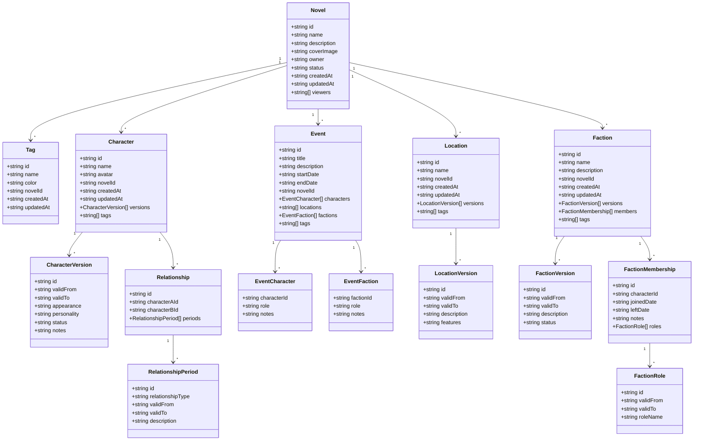
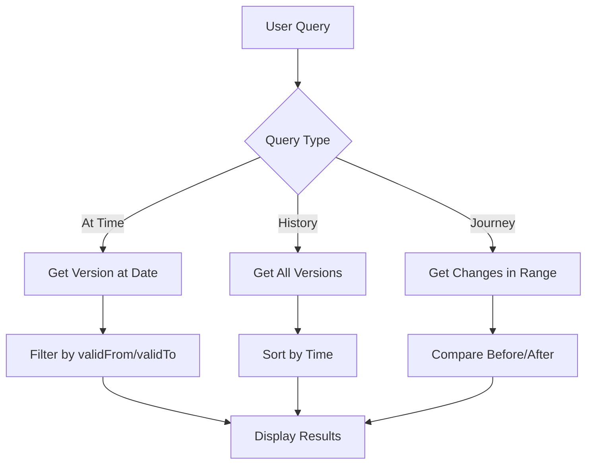

> **⚠️ ARCHIVE / HISTORY FILE - TÀI LIỆU LỊCH SỬ**
>
> **English:** This file has been merged into `business-redesign-plan.md`. It is preserved for reference purposes only.
>
> **Tiếng Việt:** File này đã được hợp nhất vào `business-redesign-plan.md`. File được giữ lại để tham khảo.
>
> **📌 IMPORTANT / QUAN TRỌNG:**
>
> - **DO NOT** continue work based on this file
> - **KHÔNG** tiếp tục thực hiện các công việc liệt kê trong file này
> - For current and future plans, please refer to: **[`business-redesign-plan.md`](story-manager/docs/plans/business-redesign-plan.md)**
> - Để xem các kế hoạch hiện tại và tương lai, vui lòng tham khảo: **[`business-redesign-plan.md`](story-manager/docs/plans/business-redesign-plan.md)**
>
> **Merged into / Hợp nhất vào:** `business-redesign-plan.md`
> **Last Archived / Lưu trữ lần cuối:** 2026-01-18
>
> ---

# Phân tích Nghiệp vụ Mới - Novel Business Requirements Analysis (ARCHIVED / ĐÃ LƯU TRỮ)

## Tổng quan / Overview

Tài liệu này phân tích sự khác biệt giữa thiết kế hiện tại và nghiệp vụ mới được yêu cầu, đồng thời đề xuất kế hoạch refactoring.

This document analyzes the differences between the current design and the new business requirements, and proposes a refactoring plan.

---

## 1. So sánh Thiết kế Cũ vs Mới / Old vs New Design Comparison

### 1.1 Novel Entity (THÊM MỚI / NEW)

**Thiết kế cũ / Old Design:**

- Không có entity Novel
- Không có khái niệm ownership, public/private status
- Không có viewer management

**Thiết kế mới / New Design:**

```typescript
interface Novel {
  id: string;
  name: string;
  description: string;
  coverImage: string | null;
  owner: string; // User ID
  status: 'public' | 'private';
  createdAt: string;
  updatedAt: string;
  viewers: string[]; // Array of user IDs
}
```

**Quy tắc chia sẻ / Sharing Rules:**

- Private: Chỉ Owner và Viewers được chỉ định mới xem được
- Public: Tất cả mọi người (kể cả khách chưa đăng nhập) đều xem được
- Chia sẻ áp dụng cho toàn bộ tiểu thuyết, không chia sẻ từng phần

---

### 1.2 Character Entity

**Thiết kế cũ / Old Design:**

```typescript
interface CharacterAttribute {
  timeRange: TimeRange;
  role: string;
  age: number | null;
  gender: string;
  appearance: string;
  personality: string;
  background: string;
  goals: string;
  flaws: string;
  skills: string;
  notes: string;
}
```

**Thiết kế mới / New Design:**

```typescript
interface Novel {
  id: string;
  name: string;
  description: string;
  coverImage: string | null;
  owner: string; // User ID
  status: 'public' | 'private';
  createdAt: string;
  updatedAt: string;
  viewers: string[]; // Array of user IDs
}

interface Character {
  id: string;
  name: string;
  avatar: string | null; // Upload ảnh đại diện
  novelId: string; // Thuộc novel nào
  createdAt: string;
  updatedAt: string;
  versions: CharacterVersion[];
  tags: string[]; // Array of tag IDs
}

interface CharacterVersion {
  id: string;
  validFrom: string | null; // Từ đầu truyện nếu null
  validTo: string | null; // Đến hiện tại nếu null
  appearance: string; // Ngoại hình (text - mô tả tự do)
  personality: string; // Tính cách (text - mô tả tự do)
  status: string; // "Sống", "Chết", "Mất tích"...
  notes: string;
}
```

**Sự khác biệt chính / Key Differences:**

1. ✅ Thêm `avatar` (upload ảnh đại diện)
2. ✅ Thêm `novelId` (thuộc novel nào)
3. ✅ Đổi tên `timeRange` → `validFrom`/`validTo` (nullable)
4. ✅ Bỏ `role`, `age`, `gender`, `background`, `goals`, `flaws`, `skills`
5. ✅ Giữ `appearance`, `personality`, `notes`
6. ✅ Thêm `status` (text: "Sống", "Chết", "Mất tích"...)
7. ✅ Thêm `tags` (array of tag IDs)

---

### 1.3 Relationship Entity

**Thiết kế cũ / Old Design:**

```typescript
interface RelationshipDetail {
  timeRange: TimeRange;
  relationshipType: string;
  description: string;
  status: 'active' | 'inactive' | 'complicated' | 'hostile' | 'allied';
  strength: number;
}
```

**Thiết kế mới / New Design:**

```typescript
interface Relationship {
  id: string;
  characterAId: string; // Nhân vật A
  characterBId: string; // Nhân vật B
  periods: RelationshipPeriod[];
}

interface RelationshipPeriod {
  id: string;
  relationshipType: string; // "Bạn bè", "Kẻ thù", "Vợ chồng", "Sư đồ"... (text - tự do nhập)
  validFrom: string | null;
  validTo: string | null;
  description: string; // Mô tả/ghi chú
}
```

**Sự khác biệt chính / Key Differences:**

1. ✅ Đổi tên `entity1Id`/`entity2Id` → `characterAId`/`characterBId` (chỉ áp dụng cho nhân vật)
2. ✅ Đổi tên `details` → `periods`
3. ✅ Đổi tên `timeRange` → `validFrom`/`validTo`
4. ✅ Bỏ `status` (active/inactive/complicated/hostile/allied)
5. ✅ Bỏ `strength` (mức độ mối quan hệ)
6. ✅ `relationshipType` là text tự do nhập (không phải enum)
7. ✅ Có thể có nhiều periods đồng thời giữa 2 nhân vật

---

### 1.4 Event Entity

**Thiết kế cũ / Old Design:**

```typescript
interface Event {
  id: string;
  name: string;
  description: string;
  timestamp: string;
  locationId: string | null;
  eventType: string;
  importance: 'low' | 'medium' | 'high' | 'critical';
  participants: string[]; // Character IDs
  outcome: string;
  impact: string;
}
```

**Thiết kế mới / New Design:**

```typescript
interface Event {
  id: string;
  title: string; // Tiêu đề
  description: string;
  startDate: string | null; // Ngày bắt đầu
  endDate: string | null; // Ngày kết thúc
  novelId: string; // Thuộc novel nào
  characters: EventCharacter[]; // Nhiều nhân vật tham gia
  locations: string[]; // 1 sự kiện có thể diễn ra ở nhiều địa điểm (many-to-many)
  factions: EventFaction[]; // Nhiều thế lực tham gia
  tags: string[]; // Gắn tags cho sự kiện
}

interface EventCharacter {
  characterId: string;
  role: string; // "Chỉ huy", "Tham gia", "Nạn nhân"...
  notes: string; // Mô tả về người đó tại sự kiện
}

interface EventFaction {
  factionId: string;
  role: string; // Vai trò
  notes: string; // Ghi chú
}
```

**Sự khác biệt chính / Key Differences:**

1. ✅ Đổi tên `name` → `title`
2. ✅ Đổi tên `timestamp` → `startDate`/`endDate` (nullable)
3. ✅ Thêm `novelId` (thuộc novel nào)
4. ✅ Đổi `participants: string[]` → `characters: EventCharacter[]` (có role + notes)
5. ✅ Đổi `locationId: string | null` → `locations: string[]` (many-to-many)
6. ✅ Thêm `factions: EventFaction[]` (nhiều thế lực tham gia)
7. ✅ Thêm `tags: string[]` (gắn tags cho sự kiện)
8. ✅ Bỏ `eventType`, `importance`, `outcome`, `impact`
9. ✅ Không cần phân cấp sự kiện (sự kiện lớn/sự kiện con)

---

### 1.5 Location Entity

**Thiết kế cũ / Old Design:**

```typescript
interface LocationAttribute {
  timeRange: TimeRange;
  locationType: string;
  climate: string;
  geography: string;
  population: string;
  culture: string;
  economy: string;
  government: string;
  notes: string;
}
```

**Thiết kế mới / New Design:**

```typescript
interface Location {
  id: string;
  name: string;
  novelId: string; // Thuộc novel nào
  createdAt: string;
  updatedAt: string;
  versions: LocationVersion[];
  tags: string[]; // Gắn tags
}

interface LocationVersion {
  id: string;
  validFrom: string | null;
  validTo: string | null;
  description: string; // Mô tả
  features: string; // Đặc điểm
}
```

**Sự khác biệt chính / Key Differences:**

1. ✅ Thêm `novelId` (thuộc novel nào)
2. ✅ Đổi tên `timeRange` → `validFrom`/`validTo`
3. ✅ Bỏ `locationType`, `climate`, `geography`, `population`, `culture`, `economy`, `government`
4. ✅ Giữ `description`, `notes` → `description`, `features`
5. ✅ Thêm `tags: string[]` (gắn tags)
6. ✅ Không cần phân cấp (Quốc gia > Thành phố...)

---

### 1.6 Faction Entity

**Thiết kế cũ / Old Design:**

```typescript
interface FactionAttribute {
  timeRange: TimeRange;
  factionType: string;
  ideology: string;
  goals: string;
  resources: string;
  influence: string;
  members: string[]; // Character IDs
  leader: string | null; // Character ID
  notes: string;
}
```

**Thiết kế mới / New Design:**

```typescript
interface Faction {
  id: string;
  name: string;
  description: string;
  novelId: string; // Thuộc novel nào
  createdAt: string;
  updatedAt: string;
  versions: FactionVersion[];
  members: FactionMembership[]; // Thành viên
  tags: string[]; // Gắn tags riêng cho thế lực
}

interface FactionVersion {
  id: string;
  validFrom: string | null;
  validTo: string | null;
  description: string; // Mô tả
  status: string; // "Hoạt động", "Giải tán"...
}

interface FactionMembership {
  id: string;
  characterId: string;
  joinedDate: string | null; // Ngày tham gia
  leftDate: string | null; // Ngày rời đi (null = đang tham gia)
  notes: string;
  roles: FactionRole[]; // Vai trò thay đổi theo thời gian
}

interface FactionRole {
  id: string;
  validFrom: string | null;
  validTo: string | null;
  roleName: string; // Vai trò được quản lý qua Tags
}
```

**Sự khác biệt chính / Key Differences:**

1. ✅ Thêm `novelId` (thuộc novel nào)
2. ✅ Đổi tên `timeRange` → `validFrom`/`validTo`
3. ✅ Bỏ `factionType`, `ideology`, `goals`, `resources`, `influence`, `leader`
4. ✅ Đổi `members: string[]` → `members: FactionMembership[]` (có joinedDate, leftDate, notes, roles)
5. ✅ Thêm `status` trong version ("Hoạt động", "Giải tán"...)
6. ✅ Thêm `tags: string[]` (gắn tags riêng cho thế lực)
7. ✅ Vai trò được quản lý qua Tags với versioning
8. ✅ Không cần phân cấp (tổ chức lớn > chi nhánh...)

---

### 1.7 Tag Entity (THÊM MỚI / NEW)

**Thiết kế cũ / Old Design:**

- Không có entity Tag

**Thiết kế mới / New Design:**

```typescript
interface Tag {
  id: string;
  name: string; // Tên tag
  color: string; // Hex color (#FF5733) - để phân biệt trực quan
  novelId: string; // Thuộc novel nào
  createdAt: string;
  updatedAt: string;
}
```

**Đặc điểm / Features:**

- Tags dùng chung cho toàn bộ novel
- 1 tag có thể gắn cho nhiều loại entities:
  - Nhân vật
  - Sự kiện
  - Địa điểm
  - Thế lực
  - Vai trò trong thế lực

---

## 2. Quy tắc Versioning & Thời gian / Versioning & Time Rules

### 2.1 Định dạng thời gian / Time Format

- Hỗ trợ: Ngày/Tháng/Năm (DD/MM/YYYY)
- Có thể chỉ có Năm (YYYY)
- Nullable: không xác định thời gian cụ thể

### 2.2 Quy tắc versioning (áp dụng cho Character, Location, Faction)

```typescript
// Khoảng thời gian hiệu lực:
validFrom = NULL → Từ đầu truyện
validTo = NULL → Đến hiện tại/tương lai

// Ví dụ:
// Version 1: validFrom = NULL, validTo = 2014-12-31 → "Từ đầu đến 2014"
// Version 2: validFrom = 2015-01-01, validTo = NULL → "Từ 2015 đến nay"
```

**Truy vấn tại thời điểm / Query at time:**

```
Tìm version có: (validFrom IS NULL OR validFrom <= date) AND (validTo IS NULL OR validTo >= date)
Sắp xếp theo validFrom DESC → Lấy version 1 (gần nhất)
```

### 2.3 Quy tắc cho Relationship Periods

- Tương tự versioning
- Có thể có nhiều periods cùng lúc (nhiều quan hệ đồng thời)

### 2.4 Quy tắc cho Faction Membership

- Có thể có nhiều records (tham gia nhiều lần)
- Mỗi membership có joinedDate và leftDate
- Vai trò trong mỗi membership cũng có versioning

---

## 3. Tính năng Tra cứu & Truy vấn / Query & Retrieval Features

### 3.1 Tra cứu nhân vật tại thời điểm / Query Character at Time

**Input:** Character ID + Date
**Output:**

- ✅ Ngoại hình & tính cách (version tại thời điểm đó)
- ✅ Trạng thái (sống/chết/mất tích)
- ✅ Các quan hệ đang có (tất cả relationships active tại thời điểm đó)
- ✅ Các thế lực đang tham gia + vai trò hiện tại
- ✅ Các sự kiện đã tham gia (trước thời điểm đó)
- ✅ Tags của nhân vật

### 3.2 Lịch sử quan hệ giữa 2 người / Relationship History

**Input:** Character A ID + Character B ID
**Output:**

- ✅ Timeline các mối quan hệ đã trải qua
- ✅ Mỗi period hiển thị: loại quan hệ, thời gian, mô tả

### 3.3 Hành trình nhân vật (Character Journey)

**Input:** Character ID + (Optional) Start Date + End Date
**Output:**

- ✅ Tất cả sự kiện tham gia (trong khoảng thời gian)
- ✅ Các thay đổi về quan hệ
- ✅ Các thay đổi về thế lực (tham gia/rời/đổi vai trò)
- ✅ Các thay đổi về ngoại hình/tính cách

### 3.4 So sánh nhân vật giữa 2 thời điểm / Compare Character Between Times

**Input:** Character ID + From Date + To Date
**Output:**

- ✅ Thay đổi về ngoại hình/tính cách
- ✅ Quan hệ mới thêm/xóa/thay đổi
- ✅ Thế lực tham gia/rời/quay lại/đổi vai trò
- ✅ Các sự kiện xảy ra giữa 2 thời điểm

### 3.5 Chi tiết nhân vật đầy đủ / Full Character Details

**Input:** Character ID
**Output:** Tất cả thông tin

- ✅ Thông tin cơ bản
- ✅ Tất cả versions (lịch sử ngoại hình/tính cách)
- ✅ Tất cả relationships (lịch sử quan hệ với từng người)
- ✅ Tất cả factions (lịch sử tham gia + vai trò)
- ✅ Tất cả events tham gia
- ✅ Tags
- ✅ Sắp xếp theo mốc thời gian

### 3.6 Timeline tổng hợp / Comprehensive Timeline

Hiển thị tất cả thay đổi theo timeline:

- ✅ Version changes (ngoại hình, tính cách)
- ✅ Relationship changes (bắt đầu, kết thúc, thay đổi)
- ✅ Faction changes (tham gia, rời, đổi vai trò)
- ✅ Events (sự kiện tham gia)
- ✅ Sắp xếp theo thời gian tăng dần

---

## 4. Tính năng Hiển thị (Visualization) / Display Features

### 4.1 Các chế độ xem / View Modes

**Timeline View (Dòng thời gian):**

- ✅ Hiển thị events, character versions, relationship changes theo trục thời gian
- ✅ Filter theo character/faction/location
- ✅ Zoom in/out theo khoảng thời gian
- ✅ Click vào item để xem chi tiết

**Relationship Graph (Sơ đồ quan hệ):**

- ✅ Nodes: Nhân vật
- ✅ Edges: Các mối quan hệ (có thể nhiều edge giữa 2 nodes)
- ✅ Color-coded theo loại quan hệ
- ✅ Time slider: Kéo để xem quan hệ tại thời điểm khác nhau
- ✅ Interactive: Click để xem chi tiết

**List/Table View:**

- ✅ Danh sách dạng bảng
- ✅ Sort, filter, search
- ✅ Hiển thị thông tin tóm tắt

**Detail View:**

- ✅ Trang chi tiết entity (Character, Event, Location, Faction)
- ✅ Hiển thị đầy đủ thông tin + lịch sử
- ✅ Timeline của riêng entity đó

### 4.2 Công cụ tra cứu (Query Tool)

- ✅ Date picker: Chọn thời điểm
- ✅ Entity selector: Chọn nhân vật/địa điểm/thế lực
- ✅ Query type selector: Loại truy vấn (at time, compare, journey...)
- ✅ Results display: Hiển thị kết quả (table/cards/timeline)

---

## 5. Kiến trúc Dữ liệu Đề xuất / Proposed Data Architecture

### 5.1 Entity Hierarchy



### 5.2 Data Flow for Time-Based Queries



---

## 6. Kế hoạch Triển khai / Implementation Plan

### 6.1 Giai đoạn 1: Refactor Types (Cập nhật TypeScript types)

**Tasks:**

- [ ] Tạo `src/types/novel.ts` - Novel entity types
- [ ] Tạo `src/types/tag.ts` - Tag entity types
- [ ] Cập nhật `src/types/character.ts` - Thêm avatar, novelId, tags, ref versions
- [ ] Cập nhật `src/types/relationship.ts` - Đổi sang characterAId/characterBId, periods
- [ ] Cập nhật `src/types/event.ts` - Thêm startDate/endDate, characters/locations/factions, tags
- [ ] Cập nhật `src/types/location.ts` - Thêm novelId, tags, ref versions
- [ ] Cập nhật `src/types/faction.ts` - Thêm novelId, tags, members với membership
- [ ] Cập nhật `src/types/common.ts` - Thêm TimeRange helper functions
- [ ] Tạo `src/types/query.ts` - Query result types

### 6.2 Giai đoạn 2: Refactor Mock Data (Cập nhật dữ liệu giả)

**Tasks:**

- [ ] Tạo mock data cho Novel
- [ ] Tạo mock data cho Tag
- [ ] Cập nhật mock data cho Character (với versions, tags)
- [ ] Cập nhật mock data cho Relationship (với periods)
- [ ] Cập nhật mock data cho Event (với characters/locations/factions)
- [ ] Cập nhật mock data cho Location (với versions, tags)
- [ ] Cập nhật mock data cho Faction (với members, tags)
- [ ] Cập nhật DataContext để quản lý Novel và Tag

### 6.3 Giai đoạn 3: Tạo Novel Module

**Tasks:**

- [ ] Tạo `src/app/novels/NovelsPage.tsx` - Trang danh sách novel
- [ ] Tạo `src/app/novels/NovelDetailPage.tsx` - Trang chi tiết novel
- [ ] Tạo `src/app/novels/NovelCreatePage.tsx` - Trang tạo novel
- [ ] Tạo `src/app/novels/NovelEditPage.tsx` - Trang sửa novel
- [ ] Tạo `src/components/domain/novel/NovelTable.tsx` - Bảng danh sách novel
- [ ] Tạo `src/components/domain/novel/NovelForm.tsx` - Form tạo/sửa novel
- [ ] Thêm routing cho novel pages
- [ ] Thêm translation keys cho novel

### 6.4 Giai đoạn 4: Tạo Tag Module

**Tasks:**

- [ ] Tạo `src/app/tags/TagsPage.tsx` - Trang danh sách tag
- [ ] Tạo `src/components/domain/tag/TagTable.tsx` - Bảng danh sách tag
- [ ] Tạo `src/components/domain/tag/TagForm.tsx` - Form tạo/sửa tag
- [ ] Tạo `src/components/domain/tag/TagPicker.tsx` - Component chọn tag (dùng trong các entity khác)
- [ ] Thêm routing cho tag pages
- [ ] Thêm translation keys cho tag

### 6.5 Giai đoạn 5: Refactor Character Module

**Tasks:**

- [ ] Cập nhật `CharacterTable.tsx` - Hiển thị avatar, tags
- [ ] Cập nhật `CharacterForm.tsx` - Thêm upload avatar, chọn tags, quản lý versions
- [ ] Cập nhật `CharacterDetailPage.tsx` - Hiển thị versions timeline
- [ ] Tạo `CharacterVersionForm.tsx` - Form thêm/sửa version
- [ ] Cập nhật translation keys cho character

### 6.6 Giai đoạn 6: Refactor Relationship Module

**Tasks:**

- [ ] Cập nhật `RelationshipsPage.tsx` - Hiển thị periods
- [ ] Tạo `RelationshipPeriodForm.tsx` - Form thêm/sửa period
- [ ] Cập nhật translation keys cho relationship

### 6.7 Giai đoạn 7: Refactor Event Module

**Tasks:**

- [ ] Cập nhật `EventTable.tsx` - Hiển thị startDate/endDate
- [ ] Cập nhật `EventForm.tsx` - Thêm startDate/endDate, characters với role/notes, locations, factions, tags
- [ ] Tạo `EventCharacterForm.tsx` - Form thêm/sửa character vào event
- [ ] Cập nhật translation keys cho event

### 6.8 Giai đoạn 8: Refactor Location Module

**Tasks:**

- [ ] Cập nhật `LocationTable.tsx` - Hiển thị tags
- [ ] Cập nhật `LocationForm.tsx` - Thêm tags, quản lý versions
- [ ] Tạo `LocationVersionForm.tsx` - Form thêm/sửa version
- [ ] Cập nhật translation keys cho location

### 6.9 Giai đoạn 9: Refactor Faction Module

**Tasks:**

- [ ] Cập nhật `FactionsPage.tsx` - Hiển thị members, tags
- [ ] Cập nhật `FactionForm.tsx` - Thêm tags, quản lý versions
- [ ] Tạo `FactionVersionForm.tsx` - Form thêm/sửa version
- [ ] Tạo `FactionMembershipForm.tsx` - Form thêm/sửa membership
- [ ] Tạo `FactionRoleForm.tsx` - Form thêm/sửa role
- [ ] Cập nhật translation keys cho faction

### 6.10 Giai đoạn 10: Tạo Query & Visualization Features

**Tasks:**

- [ ] Tạo `src/components/query/QueryTool.tsx` - Công cụ tra cứu tổng hợp
- [ ] Tạo `src/components/query/CharacterAtTimeQuery.tsx` - Tra cứu nhân vật tại thời điểm
- [ ] Tạo `src/components/query/RelationshipHistoryQuery.tsx` - Lịch sử quan hệ
- [ ] Tạo `src/components/query/CharacterJourneyQuery.tsx` - Hành trình nhân vật
- [ ] Tạo `src/components/query/CharacterCompareQuery.tsx` - So sánh nhân vật
- [ ] Tạo `src/components/visualization/TimelineView.tsx` - Timeline view
- [ ] Tạo `src/components/visualization/RelationshipGraph.tsx` - Relationship graph
- [ ] Tạo `src/app/query/QueryPage.tsx` - Trang tra cứu
- [ ] Thêm routing cho query pages
- [ ] Thêm translation keys cho query & visualization

### 6.11 Giai đoạn 11: Cập nhật Layout & Navigation

**Tasks:**

- [ ] Cập nhật `Sidebar.tsx` - Thêm menu cho Novel, Tag, Query
- [ ] Cập nhật `Layout.tsx` - Thêm Novel selector (nếu có nhiều novel)
- [ ] Cập nhật `Header.tsx` - Hiển thị novel hiện tại

### 6.12 Giai đoạn 12: Testing & Polish

**Tasks:**

- [ ] Test tất cả CRUD operations
- [ ] Test time-based queries
- [ ] Test versioning logic
- [ ] Test tag assignment
- [ ] Test visualization features
- [ ] Fix bugs
- [ ] Update documentation

---

## 7. Rủi ro & Giải pháp / Risks & Mitigations

### 7.1 Rủi ro / Risks

1. **Complexity of versioning logic** - Logic versioning phức tạp
2. **Breaking existing features** - Làm hỏng các tính năng hiện có
3. **Data migration issues** - Vấn đề di chuyển dữ liệu
4. **UI complexity** - Sự phức tạp của UI

### 7.2 Giải pháp / Mitigations

1. **Create utility functions** - Tạo các hàm trợ giúp cho versioning queries
2. **Incremental refactoring** - Refactor từng phần, test kỹ trước khi tiếp tục
3. **Keep backward compatibility** - Giữ tương thích ngược khi có thể
4. **Progressive disclosure** - Hiển thị dần dần, tránh quá tải người dùng

---

## 8. Tiếp theo / Next Steps

1. ✅ Review kế hoạch này với người dùng
2. ✅ Điều chỉnh kế hoạch theo feedback
3. ✅ Bắt đầu triển khai từ Giai đoạn 1

---

**Lưu ý / Note:** Kế hoạch này giữ nguyên giao diện, icon, màu sắc hiện tại theo yêu cầu của người dùng. Chỉ thay đổi nghiệp vụ và cấu trúc dữ liệu.

**Note:** This plan maintains the current interface, icons, and colors as requested. Only business logic and data structure are changed.
